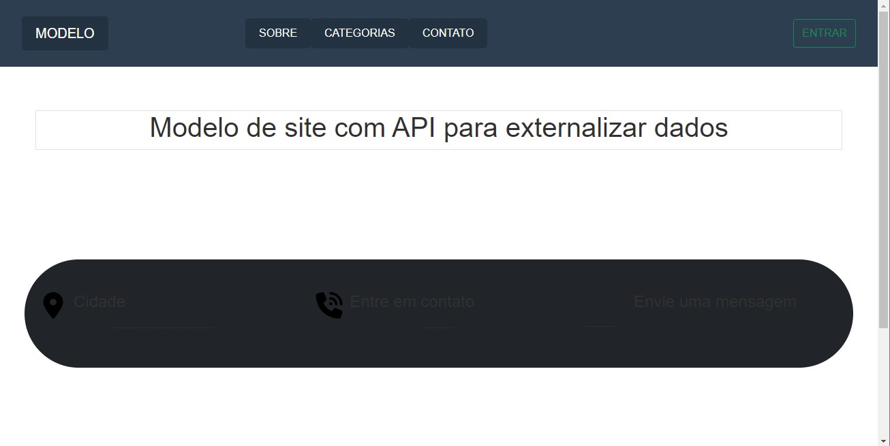
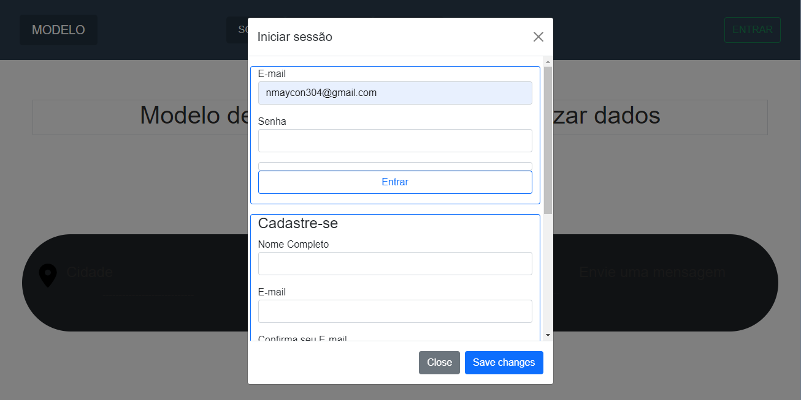
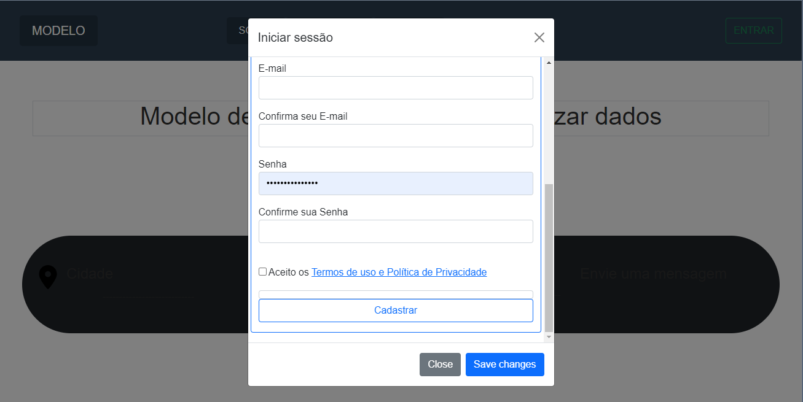
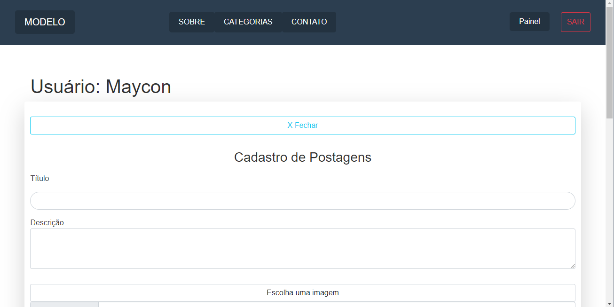
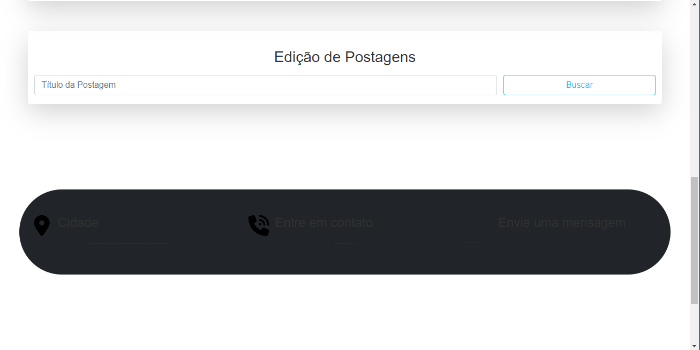
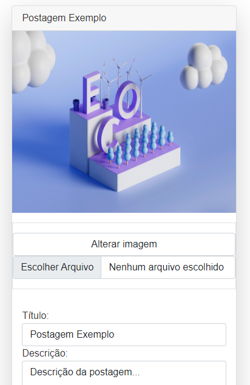
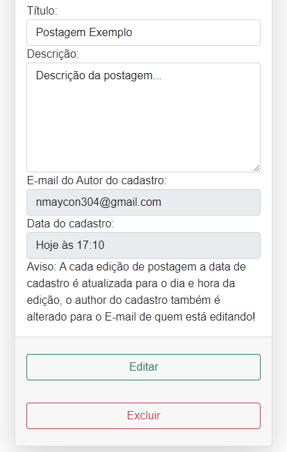

# Modelo de Sistema php com API
Este sitestema foi projetado para ser uma base na contrução de um site PHP, que pode funcionar como back-end para um aplicativo ou sistema desktop Flutter, com esta base é possível contruirm um Ecossistema abrangendo aplicação WEB, Desktop, e aplicativo móvel.

## Indice
- Tecnologias utilizadas;
- Requisitos e links que auxiliam;
- Como instalar;
- Imagens do modelo;
- Utilizando a API deste sistema para integrar com um aplicativo ou sistema desktop Flutter (Contém link da base de projeto pronta).
- Dicas de Extensões para VS Code

### Tecnologias utilizadas
- PHP, Javascript;
- HTML, CSS;
- Bootstrap, Json, Jquery;
- Composer, alguns pacotes baixados do Packagist informados mais a diante;
- Arquitetura MVC;
- API;
### Requisitos
- PHP 8.* (recomendo) <a href="https://www.youtube.com/watch?v=HzIXZVctwI8&t=65s" target="_blank">Aqui está um vídeo ensinando como instalar o PHP diretamente no computador</a>, outra alternativa é usar o <a href="https://www.apachefriends.org/pt_br/index.html" target="_blank">XAMPP</a>;
-  Apache 2.4 é um servidor de código aberto, aqui estão dois vídeos que vão ajudar na instalação: <a href="https://www.youtube.com/watch?v=IvcdwaDs-ik" target="_blank">Vídeo 1</a> - <a href="https://www.youtube.com/watch?v=Y60Vvd4lhtg&t=27s" target="_blank">Vídeo 2</a>;
- MySQL e Workbench que é um sistema de gerenciamento de banco de dados, <a href="https://www.youtube.com/watch?v=IeTbZOxEwGc" target="_blank">aqui está um vídeo ensinando a instalar</a>;
- <a href="https://getcomposer.org" target="_blank">Composer</a> é um Gerenciador de Dependências para PHP;
- Para o desenvolvimento deste modelo de sistema foram usados os seguintes pacotes: "coffeecode/router": "1.0.*", "coffeecode/optimizer": "2.0.*", "coffeecode/cropper": "2.0.3", "league/plates": "v4.0.0-alpha", "monolog/monolog": "2.0.*" e a arquitetura mostrada na playlist PHP TIPS - Robson V. Leite <a href="https://youtube.com/playlist?list=PLi_gvjv-JgXqsmCAOrueT1-4JrnMW8_Gg" target="_blank">Acesse aqui</a>, porém a pesar de usar como base, a forma como é feita a interação com o banco de dados foi modificada completamente foi incluido Middlewares entre outras alterações e desenvolvimento próprio;
- Editor de código <a href="https://code.visualstudio.com/" target="_blank">VS code</a> (recomendo);
- Este sitema foi desenvolvido utilizando Windows 10;

### Como instalar
- 1º) Certifique-se se realmente não tem o PHP instalado entrando no prompt de comando e digitando: php -v caso apareça uma verssão anterior a 8 é recomendado instalar uma mais recente caso não apareça nada instale o PHP, Apache, MySQL, Workbench, Composer e o editor VS Code na sua máquina;
- 2º) Copie o link do repositório no gitHub, va até a pasta htdocs do servidor apache, apague o endereço da pasta e digite cmd, vai abrir o prompt de comando, com o caminho da pasta, em seguida digite: git clone (da um espaço) e cole o link do repositório;
- 3º) Abra a pasta no VS Code em seguida abra o arquivo (composer.json) personalize com seus dados, abra o terminal certifique se o caminho da pasta está correto e digite o comando: composer update --ignore-platform-reqs
- 4º) Entre na pasta source em seguida abra o arquivo Config.php e altere o define ROOT para o link correspondente onde você clonou a pasta;
- 5º) Certifique se o apache foi iniciado, abra o navegador e digite o link correspondente ao projeto para visualizar o layout.

### Imagens
| Home                                                   | Login                                                                                        |
| ------------------------------------------------------ | -------------------------------------------------------------------------------------------- |
|    | |

| Cadastro de Usuário                                    |
| ------------------------------------------------------ |
|  |

| Painel do usuário                                                         | Cadastro de postagens                                        |
| ------------------------------------------------------------------------- | ------------------------------------------------------------ |
|  | 

| Edição de postagem parte 1                                                         | Edição de postagem parte 2                                   |
| ---------------------------------------------------------------------------------- | ------------------------------------------------------------ |
|  | 

### Utilizando a API deste sistema para integrar com um aplicativo ou sistema desktop Flutter
- Este modelo de sistema foi desenvolvido para ser possível a integração com um aplicativo ou outro sistema podendo utilizar o mesmo usuário e senha para acesso, cadastro integrado de usuário e CRUD de postagens, já esta pronta a base do app/sistema FLutter para ser usada neste <a href="https://github.com/Maycon-crz/flutter_login_completo_com_api_php" target="_blank">repositório</a> você encontra a o código e a documentação.

### Dicas de Extensões para VS Code
- <a href="https://marketplace.visualstudio.com/items?itemName=xdebug.php-debug" target="_blank">PHP Debug</a>
- <a href="https://marketplace.visualstudio.com/items?itemName=damianbal.vs-phpclassgen" target="_blank">PHP Class Generator</a>
- <a href="https://marketplace.visualstudio.com/items?itemName=TabNine.tabnine-vscode" target="_blank">Tabnine AI Autocomplete: Link</a>
- <a href="https://marketplace.visualstudio.com/items?itemName=Blackboxapp.blackbox" target="_blank">Blackbox AI</a>
- <a href="https://marketplace.visualstudio.com/items?itemName=Codeium.codeium" target="_blank">Codeium: AI Coding</a>
- <a href="https://marketplace.visualstudio.com/items?itemName=DEVSENSE.composer-php-vscode" target="_blank">Composer</a>
- <a href="https://marketplace.visualstudio.com/items?itemName=eamodio.gitlens" target="_blank">GitLens</a>
- <a href="https://marketplace.visualstudio.com/items?itemName=xabikos.JavaScriptSnippets" target="_blank">JavaScript (ES6) code snippets</a>
- <a href="https://marketplace.visualstudio.com/items?itemName=donjayamanne.jquerysnippets" target="_blank">jQuery Code Snippets</a>
- <a href="https://marketplace.visualstudio.com/items?itemName=bmewburn.vscode-intelephense-client" target="_blank">PHP Intelephense</a>
- <a href="https://marketplace.visualstudio.com/items?itemName=funkyremi.vscode-google-translate" target="_blank">Vscode Google Translate</a>
